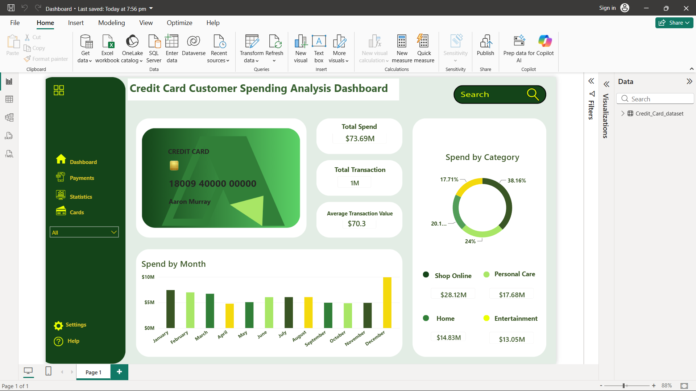

# Credit-Card-Customer-Spending-Analysis

## Overview

This project analyzes customer spending behavior using credit card transaction data and presents key business insights through an interactive Power BI dashboard.

The objective of this project is to understand spending patterns, identify high-value spending categories, analyze transaction trends, and support data-driven decision-making through visualization and KPI analysis.

## Tools Used

- Power BI
- Power Query
- DAX

## Data Preparation

The dataset was reviewed, validated, and formatted in Excel before being imported into Power BI for analysis, KPI creation, and dashboard development.

## Key Performance Indicators (KPIs)

- Total Spend
- Total Transactions
- Average Transaction Value

## Dashboard Features

### KPI Overview
Provides a high-level summary of customer spending activity through Total Spend, Total Transactions, and Average Transaction Value, helping understand spending behavior and purchasing patterns.

### Monthly Spending Analysis
Analyzes total credit card spending across different months to identify spending trends and seasonal variations.

### Spending by Category
Visualizes customer spending across different categories, highlighting the highest contributing spending segments and customer preferences.

### Customer-Level Analysis
Enables interactive filtering through customer names to analyze individual customer spending behavior and transaction activity.

## Key Insights

- Online Shopping contributes highest share of customer spending.
- Customer spending patterns vary across different months.
- A small number of spending categories account for a significant portion of total spending.
- Transaction analysis helps identify customer preferences and spending behavior.

## Business Value

This dashboard demonstrates how transaction data can be transformed into meaningful insights that support business decision-making, customer understanding, and performance monitoring.

## Skills Demonstrated

- Data Visualization
- KPI Analysis
- Data Interpretation
- Dashboard Development
- Power BI Reporting
- Insight Generation

## Dataset

Dataset Source:
https://www.kaggle.com/datasets/priyamchoksi/credit-card-transactions-dataset/data

Dataset was cleaned and formatted for analytical purposes before dashboard development.
